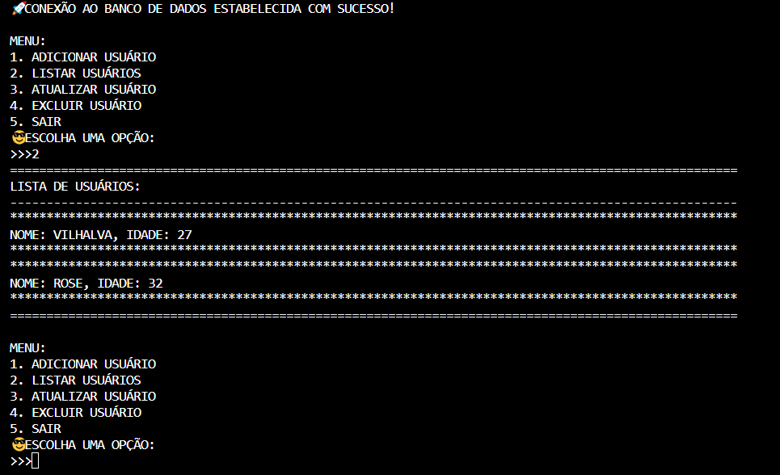
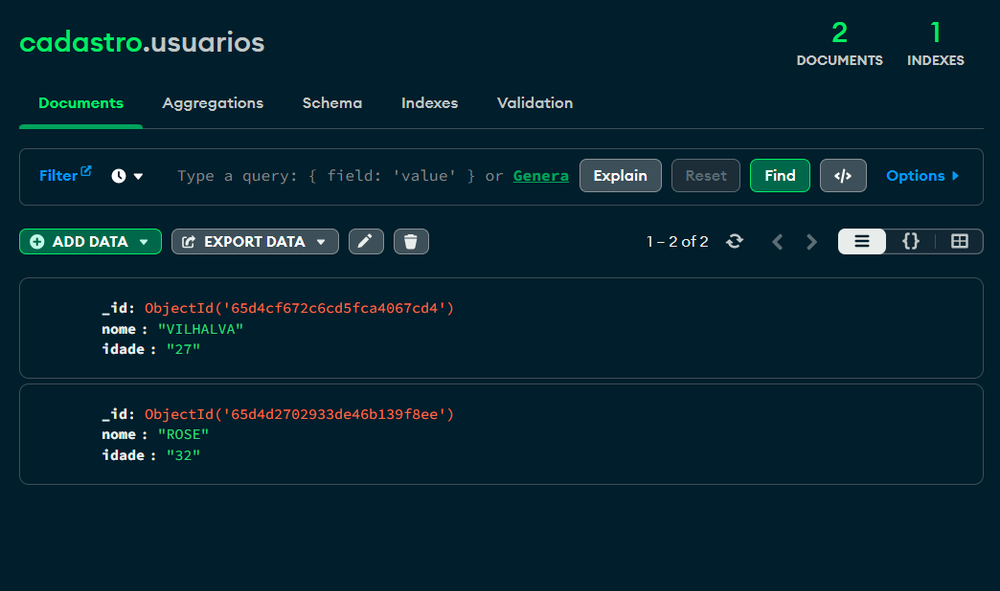

# CRUD PYTHON EM MONGODB
🎈GERENCIE O NOME E IDADE DOS USUÁRIOS NA DATABASE MONGODB.

 <br>
 <br>

## DESCRIÇÃO:
Este aplicativo é um gerenciador de usuários que permite adicionar, listar, atualizar e excluir informações de usuários armazenadas em um banco de dados MONGODB CRUD. Ele foi projetado para fornecer uma interface simples e interativa para manipular os dados dos usuários.

O aplicativo fornece um menu intuitivo para o usuário interagir com essas funcionalidades. Ele utiliza a linguagem de programação Python e o conector MONGODB para estabelecer a conexão com o banco de dados e executar as operações de manipulação de dados.

Essa aplicação é útil em cenários onde é necessário armazenar e gerenciar informações de usuários de forma eficiente, como em sistemas de cadastro, administração de usuários em plataformas web, entre outros.

## RECURSOS:
1. **Adicionar Usuário**: Permite adicionar um novo usuário ao banco de dados, fornecendo o nome e a idade do mesmo.

2. **Listar Usuários**: Apresenta uma lista de todos os usuários cadastrados no banco de dados, mostrando seus nomes e idades.

3. **Atualizar Usuário**: Permite atualizar as informações de um usuário existente no banco de dados, substituindo o nome e/ou a idade pelo novo valor fornecido.

4. **Excluir Usuário**: Remove um usuário específico do banco de dados com base no nome fornecido.

## EXECUTANDO O PROJETO:
1. **Instalação das Dependências::**
   - Entre no diretório `CODIGO` e execute o comando:

   ```bash
   pip install -r requirements.txt
   ```

2. No código fornecido, certifique-se de alterar o host e a porta do MongoDB, se necessário. Por padrão, o host é 'localhost' e a porta é 27017.

3. Para executar o arquivo Python, utilize o comando abaixo no terminal, dentro do diretório `./CODIGO`:

   ```
   python CODIGO.py
   ```

4. Isso iniciará o aplicativo e tentará estabelecer uma conexão com o banco de dados MongoDB local. Se a conexão for bem-sucedida, você verá uma mensagem indicando que a conexão foi estabelecida com sucesso.

5. Um menu será exibido com as seguintes opções:
   - **1. ADICIONAR USUÁRIO:** Permite adicionar um novo usuário ao banco de dados. Você será solicitado a digitar o nome e a idade do usuário.
   - **2. LISTAR USUÁRIOS:** Exibe uma lista de todos os usuários cadastrados no banco de dados, mostrando seus nomes e idades.
   - **3. ATUALIZAR USUÁRIO:** Permite atualizar as informações de um usuário existente. Você será solicitado a digitar o nome do usuário que deseja atualizar, o novo nome e a nova idade.
   - **4. EXCLUIR USUÁRIO:** Permite excluir um usuário existente. Você será solicitado a digitar o nome do usuário que deseja excluir.
   - **5. SAIR:** Encerra o aplicativo.

6. Escolha a opção desejada digitando o número correspondente e pressionando Enter.
7. Siga as instruções apresentadas na tela para realizar as operações desejadas, como adicionar, listar, atualizar ou excluir usuários.
8. Após concluir uma operação, o menu será exibido novamente para que você possa escolher outra opção, ou você pode optar por sair do aplicativo digitando "5" e pressionando Enter.

## NÃO SABE?
- Entendemos que para manipular arquivos em muitas linguagens e tecnologias, é necessário possuir conhecimento nessas áreas. Para auxiliar nesse aprendizado, oferecemos cursos gratuitos disponíveis:
* [CURSO DE PYTHON](https://github.com/VILHALVA/CURSO-DE-PYTHON)
* [CURSO DE MONGODB](https://github.com/VILHALVA/CURSO-DE-MONGODB)
* [CONFIRA MAIS CURSOS](https://github.com/VILHALVA?tab=repositories&q=+topic:CURSO)

## CREDITOS:
- [PROJETO CRIADO PELO VILHALVA](https://github.com/VILHALVA)


